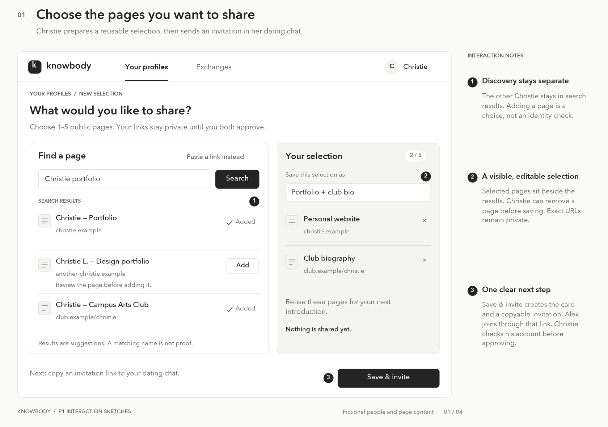
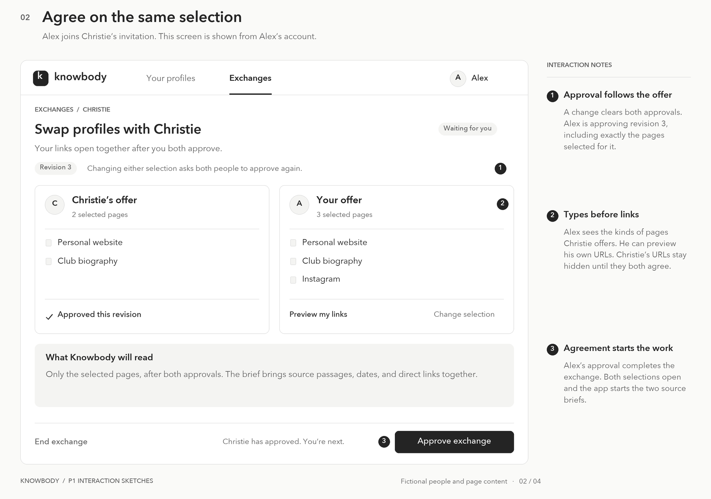
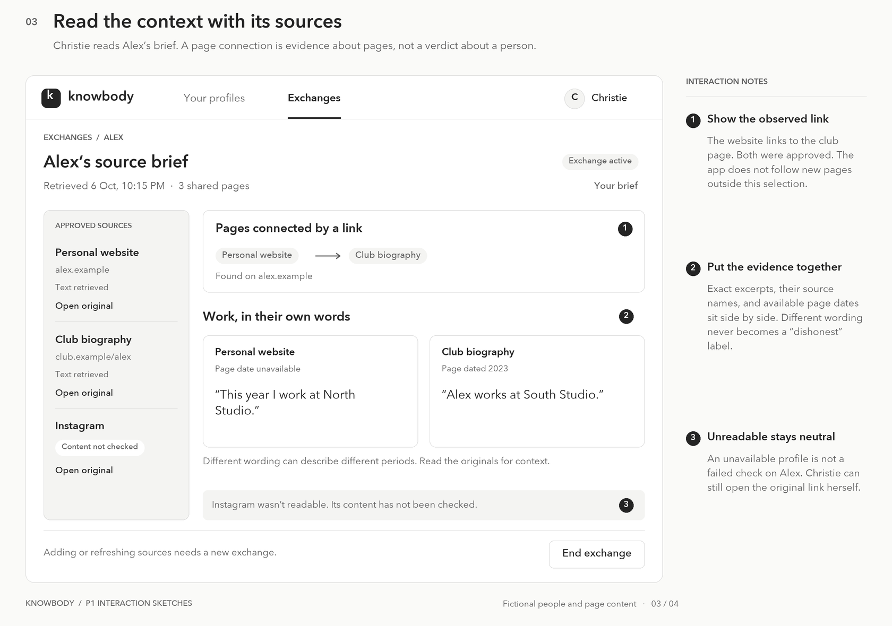
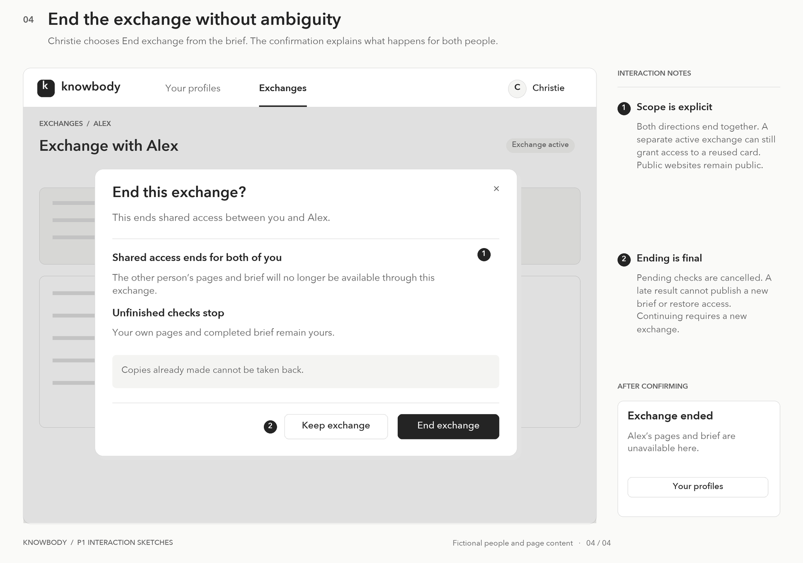

# Knowbody

## Problem Framing

### Domain

It is easy for people to meet and interact with people they know very little about. Dating-app matches often want to learn more about each other before meeting in person. They may search for public profiles themselves or ask their match to share an account.

Looking someone up takes effort, but asking for a list of accounts can also feel intrusive. The person being searched has a different concern: sharing one profile can expose other parts of their life. The problem is to make useful context easier to obtain without confusing people with their namesakes or treating disclosure as a test of character.

Essential activities that comprise the domain include:

- Finding possible sources of information about someone.

- Deciding which sources concern that person rather than a namesake.

- Comparing what those sources say and when they were written.

- Choosing what to share with a particular person.

### Stakeholders

- Person seeking context: wants useful information before meeting, without spending a lot of time searching or making the conversation feel like an investigation.

- Person sharing context: wants to introduce themselves while choosing which parts of their online life to disclose. A person can take both roles in the same conversation.

- Misidentified person: owns an unrelated profile that might be attributed to a match and wants their information kept separate.

### Bad situations

1. Searching takes time without resolving uncertainty

   Suppose Christie is meeting Alex, whom she matched with on a dating app. She searches his name and spends thirty minutes narrowing a list of profiles down to three. She has assignments to finish and stops. She still does not know which results concern Alex. Asking him to account for every result feels uncomfortable, so the effort produces little useful context.

2. Information is attributed to the wrong person

   Suppose Ann finds a LinkedIn profile with her match's name and city, but a different school. She concludes that he misled her and cancels their date. The profile actually belongs to someone else. Ann loses an opportunity, while her match never learns which assumption affected her decision.

3. Sharing and checking have different boundaries

   Suppose Ben sends Riley a public portfolio. Riley follows several links and later treats an old club biography as a statement about Ben's current work. Ben wanted to share his projects. He did not expect every linked page to become part of a background report. Riley no longer remembers when the biography was written.

Across these situations, more information does not necessarily resolve uncertainty. Even a relevant page can mislead when its date or connection to the person is unclear.

### Corroboration

Looking up dates is established behavior. In a 2021 YouGov survey, 44% of respondents who had used dating apps reported searching a date's social media before meeting. A study of 157 undergraduates found that 75.5% had searched a potential romantic partner's social media. These findings support the prevalence of searching, but do not establish how often it is difficult or why. [Ballard, 2021](https://yougov.com/en-us/articles/36301-dating-apps-background-checks-safety-poll), [Perkins, 2021](https://scholarworks.moreheadstate.edu/msu_faculty_research/1019/).

Incorrect identity matching can cost people opportunities. The CFPB documented people being denied jobs or housing after screening reports associated them with someone else's records. This is a different setting from dating, so it supports the potential harm of misidentification, not its frequency in this domain. [CFPB, 2021](https://www.consumerfinance.gov/archive/newsroom/cfpb-takes-action-to-stop-false-identification-by-background-screeners/).

A review of source evaluation describes people ignoring or only superficially processing source information. This suggests that readers may overlook where a statement came from when comparing information across pages. [Bouali and Kolinsky, 2023](https://dipot.ulb.ac.be/dspace/bitstream/2013/367096/3/BoualiKolinskyThinkingSkillsCreativity2023.pdf).

Disclosure can also create harm. A study of 114 closeted LGBTQ+ dating-service users in the US, with nine follow-up interviews, documented privacy concerns and deliberate limits on sharing. Choosing not to share can reflect privacy needs rather than dishonesty. [Bouma-Sims et al., 2024](https://petsymposium.org/popets/2024/popets-2024-0046.pdf).

### Workarounds and comparables

- Google and manual browsing: flexible and immediately available. Searchers have to separate namesakes on their own. As they move between pages, they must also keep track of where each statement came from and when it was written.

- Direct messages: let people share selected profiles in an existing conversation. Sending two links is easy and may be sufficient. The recipient still has to read the pages and compare their sources and dates.

- Linktree: collects links and offers profile access controls, making several pages easier to share together. The reader still has to interpret what the linked pages say. [Linktree Profile Lock](https://linktr.ee/help/en/articles/15965888-make-your-linktree-private-with-profile-lock-beta).

- People-search reports: reduce searching but can obscure how information was associated with someone. A larger report does not necessarily improve the identity match.

- Photo verification: can address resemblance to profile photos, but does not establish education, employment, or trustworthiness. [Tinder Photo Verification](https://www.help.tinder.com/hc/en-us/articles/360034941812-Photo-Verification).

### Solution sketch

A potential solution is an application that helps two people exchange selected public profiles and compare information from those pages before meeting. Each person searches for their own public pages or adds links they already know, then chooses which to share. Search suggestions remain separate until selected, so a same-name result is not automatically added to someone's background. One person sends an invitation through their existing dating chat. Both review the kinds of pages offered and approve the exchange before either person's links are revealed. Changing the selection requires both to approve again.

The application then reads the agreed pages and gathers relevant passages into a source brief. It shows direct links between those pages and places information about work, education, or projects beside its source and available date. For example, a current portfolio and an older club biography might name different employers. Displaying their wording and dates together helps the reader assess the difference. Pages that cannot be read remain available as links labeled "Content not checked". A selected profile is still someone's own attribution, and matching information does not prove identity or truth.

Bringing passages together could reduce the time spent browsing and comparing pages. Each passage stays attached to its source. Participants choose which pages the application examines, and either can end shared access, although information already copied cannot be taken back. Automatic source comparison is the proposed benefit beyond sending links. Whether it saves enough effort to justify an exchange still needs to be tested with people willing to share useful public material.

## Application Pitch

You look someone up before a first date and end up with several profiles that could be theirs. Even after they send you a couple of links, you still have to read the pages and remember which information came from where.

Knowbody brings passages from the profiles you agree to share into one place, with a link back to each source.

Start by searching for your own public pages or adding links you already know. Only the pages you choose become part of your selection.

- Swap what you're comfortable sharing: Choose a few profiles and invite your match to do the same. You both see which kinds of pages are offered before approving the exchange. Neither person's links are revealed until both agree, and changing the selection requires fresh approval.

- Compare what the pages say: Knowbody puts relevant passages beside their sources so you can read them together. It also shows direct links between the agreed pages. If the app cannot read a page, its link remains available with the label "Content not checked".

You decide what to share and what to make of the information. Knowbody does not score people or treat missing information or a refusal to share as a warning. Either person can end the exchange, but information already seen or copied cannot be taken back.

## Concept Design

### Concept specifications

The five concepts separate account identification, reusable source selections, mutual agreement, access, and automated research. External types appear in brackets after each concept name. All state sets start empty. An action changes only the state described in its effects. The reactions below connect the concepts.

#### Authenticating

~~~text
concept Authenticating
purpose
  Identify users through their registered credentials.
principle
  If a person registers a username and password, authenticating with the same credentials identifies them as the registered user.
state
  a set of Users with
    a unique username String
    a password String
actions
  register (username: String, password: String): returns (user: User)
    where username and password are nonempty, and no user has username
    then creates a user with the given username and password, and returns user

  authenticate (username: String, password: String): returns (user: User)
    where a user exists with the given username and password
    then returns that user without changing state
~~~

Authenticating identifies a Knowbody account. It does not verify a person's real-world identity or their public profiles.

#### Collecting

~~~text
concept Collecting [User]
purpose
  Reuse a chosen set of source links without assembling it again.
principle
  If a person creates a card, they can retrieve and reuse that exact selection. They can archive it when it is no longer useful. Creating a different selection leaves the earlier card intact.
state
  a set of Cards with
    an owner User
    a label String
    a urls set of String
    an archived Flag
actions
  create (owner: User, label: String, urls: set of String): returns (card: Card)
    where label is nonempty and urls contains one to five distinct public HTTPS page URLs
    then creates a card with the given owner, label, and urls, sets archived to false, and returns card

  archive (owner: User, card: Card)
    where card exists and its owner is owner
    then sets archived to true
~~~

A card's owner, label, and URLs never change. Archiving stops future offers through the reactions. It does not end existing exchanges. A private discovery service can suggest URLs from a search query, but the user chooses the URLs before creating a card.

#### Exchanging

~~~text
concept Exchanging [User, Item]
purpose
  Reach agreement on a two-way release without either person having to disclose first.
principle
  If one person offers an item and another joins and makes an offer, both can approve the same selection to activate the exchange. Changing an offer clears both approvals. Either person can end it.
types
  Status is OPEN or ACTIVE or ENDED
state
  a set of Exchanges with
    a first User
    an optional second User
    a unique invitation String
    a firstItem Item
    a firstPreview String
    an optional secondItem Item
    an optional secondPreview String
    a revision Number
    an approvals set of User
    a status Status
actions
  open (first: User, item: Item, preview: String): returns (exchange: Exchange, invitation: String)
    then creates an OPEN exchange with the given first, firstItem, and firstPreview, a fresh unguessable invitation, revision 1, no second participant or second offer, and no approvals, and returns exchange and invitation

  join (user: User, invitation: String)
    where invitation identifies an OPEN exchange with no second participant, and user differs from first
    then sets second to user

  offer (user: User, exchange: Exchange, item: Item, preview: String, revision: Number)
    where exchange is OPEN, user is a participant, and revision equals its current revision
    then replaces only user's item and preview, increments revision, and clears approvals

  approve (user: User, exchange: Exchange, revision: Number)
    where exchange is OPEN, user is a participant, both offers exist, and revision equals its current revision
    then adds user to approvals and sets status to ACTIVE if both participants have approved

  end (user: User, exchange: Exchange)
    where exchange exists, its status is OPEN or ACTIVE, and user is a participant
    then sets status to ENDED
~~~

A participant is the first user or the second user once they have joined. Joining is not approval, and an ended exchange cannot reopen.

The application supplies previews of page types, without usernames, URLs, or extracted facts. The first participant checks the joining account before approving. Offers need not contain equal numbers or kinds of sources.

#### Sharing

~~~text
concept Sharing [User, Item, Scope]
purpose
  End access for one interaction without disturbing access for others.
principle
  If an owner registers an item and grants a viewer access under two scopes, revoking one scope leaves the other grant available. Revoking the last grant ends the viewer's access. The owner keeps it.
state
  a set of OwnedItems with
    a unique item Item
    an owner User
  a set of Grants with
    an item Item
    a viewer User
    a scope Scope
    unique item and viewer and scope
actions
  register (owner: User, item: Item)
    where item has no recorded owner
    then creates an OwnedItem associating item with owner

  grant (owner: User, viewer: User, item: Item, scope: Scope)
    where owner is the recorded owner of item
    then adds a grant for item, viewer, and scope if it is absent

  revoke (scope: Scope)
    then removes all grants with the given scope
~~~

An item is readable only by its recorded owner or a viewer with a remaining grant. An unregistered item has no readers. Ownership never changes, and revocation removes grants only for the given scope.

#### Researching

~~~text
concept Researching [User, Context]
purpose
  Make material from several pages easier to compare while preserving the evidence for each comparison.
principle
  If a report starts with a fixed set of URLs and retrieval finishes, it presents the readable sources and cited comparisons together. Unavailable pages do not prevent partial results. Cancelling an unfinished report prevents a late result from being stored.
types
  Status is PENDING or READY or FAILED or CANCELLED
  SourceStatus is READABLE or UNAVAILABLE
  Kind is LINK or SAME_TEXT or PASSAGES
state
  a set of Reports with
    an owner User
    a context Context
    a urls set of String
    a status Status
  a set of Sources with
    a report Report
    a url String
    an optional title String
    an outcome SourceStatus
    an excerpt String
    a retrievedAt DateTime
    an optional pageDate String
    unique report and url
  a set of Findings with
    a report Report
    a kind Kind
    a sources set of Source
    an explanation String
actions
  start (owner: User, context: Context, urls: set of String): returns (report: Report)
    where urls contains one to five URLs
    then creates a PENDING report with the given owner, context, and urls, no sources or findings, and returns report

  finish (report: Report, sourceData: set of SourceData, findingData: set of FindingData)
    where report is PENDING, sourceData gives one outcome for each saved URL and no others, and excerpts come from the retrieved text. Unavailable pages have empty excerpts. Each finding cites at least two readable sources and describes an observed link, matching wording, or passages for comparison.
    then creates Sources and Findings for report from the inputs and sets status to READY

  fail (report: Report)
    where report is PENDING
    then sets status to FAILED

  cancel (report: Report)
    where report exists
    then changes PENDING to CANCELLED and leaves other statuses unchanged
~~~

SourceData supplies the Sources fields except report. FindingData supplies kind, sourceURLs (a set of String), and explanation. Both are fixed input values. A LINK finding names the direction, SAME_TEXT means the wording matches apart from spacing, and PASSAGES places excerpts side by side. These comparisons do not establish identity or truth. A report can finish with no findings if none are supported.

retrievedAt records when a page was read. pageDate is included only when the page supplies a date.

### Essential reactions

UI represents application requests. Except for registration and sign-in, requests require a signed-in account, which supplies user. Worker represents the internal retrieval service. The following reactions cover the essential connections. Routine requests to create cards, join, archive, or end an exchange use the corresponding actions above. Other concept actions are reached only through these reactions. Each matching set of values triggers a reaction.

~~~text
when UI.register (username, password)
then Authenticating.register (username, password)

when UI.signIn (username, password)
then Authenticating.authenticate (username, password)

when Collecting.create (owner, label, urls): (card)
then Sharing.register (owner, card)

when UI.invite (user, card)
where Collecting: user owns card and card is unarchived
then Exchanging.open (user, card, a preview of page types)

when UI.changeOffer (user, exchange, card, revision)
where Collecting: user owns card and card is unarchived
then Exchanging.offer (user, exchange, card, its preview, revision)

when UI.approve (user, exchange, revision)
where Exchanging: both offered items exist
and Collecting: both are unarchived cards
then Exchanging.approve (user, exchange, revision)

when Exchanging.approve (user, exchange, revision)
where Exchanging: exchange is ACTIVE, owner is a participant, viewer is the other participant, and card is owner's offered item
then Sharing.grant (owner, viewer, card, exchange)

when Exchanging.approve (user, exchange, revision)
where Exchanging: exchange is ACTIVE, owner is a participant, and card is owner's offered item
and Collecting: card has urls
then Researching.start (owner, exchange, urls)

when Researching.start (owner, exchange, urls): (report)
then Sharing.register (owner, report)

when Sharing.register (owner, report)
where Researching: report has context exchange
and Exchanging: exchange is ACTIVE, owner is a participant, and viewer is the other participant
then Sharing.grant (owner, viewer, report, exchange)

when Worker.result (report, sourceData, findingData)
where Researching: report is PENDING and has context exchange
and Exchanging: exchange is ACTIVE
then Researching.finish (report, sourceData, findingData)

when Worker.failure (report)
where Researching: report is PENDING and has context exchange
and Exchanging: exchange is ACTIVE
then Researching.fail (report)

when Exchanging.end (user, exchange)
then Sharing.revoke (exchange)

when Exchanging.end (user, exchange)
where Researching: report has context exchange
then Researching.cancel (report)
~~~

A successful Authenticating.authenticate result signs the user into the application. A failed attempt returns no user and does not sign them in.

When both participants have approved the current revision, the exchange becomes ACTIVE. At that point, both cards are shared and one report starts for each participant. These changes happen together. A report is registered before access to it is granted. Ending the exchange removes both directions of shared access and cancels unfinished reports together.

When a report starts, Worker retrieves only its saved URLs and supplies either a result or a failure. Only this internal service can submit those responses. A late result is ignored after the exchange ends. Refreshing requires a new exchange, plus a new card if the URLs change.

### Brief note

Authenticating.User supplies User in the other concepts. The application keeps track of the authenticated account between requests and clears it on sign-out. Collecting.Card supplies Exchanging.Item. Cards and reports use distinct item identities in Sharing. Sharing.Scope and Researching.Context identify an exchange. The concepts do not inspect each other's fields. Reactions connect agreement to access and research.

The application checks Sharing before displaying any card or report. Only participants can view an exchange's offers and approval status. Before agreement, they see the other person's page types, not the exact URLs or content.

Ending an exchange removes access through that exchange to the other person's card and brief. The exchange record remains marked Ended. A separate active exchange can still grant access to a reused card. Each owner retains their own card and completed report. Copies already made and independently public websites are outside this control. Joining links a Knowbody account to the exchange. It does not verify the person's legal identity.

Search discovery remains a supporting service.

## UI Sketches

These annotated wireframes show one fictional exchange. They use the same navigation and action placement throughout. Source URLs use reserved .example domains. The page content is illustrative, not live evidence.

"Save & invite" saves a card and opens an exchange. The resulting invitation link can be copied into the dating chat. Joining users use the same source picker with "Use this selection" to save a card and offer it in the existing exchange. Changing an offer also uses this picker and creates a new card. These controls compose the createCard, invite, and changeOffer actions above.

1. Find and choose sources

   

2. Agree on an exchange

   

3. Read the source brief

   

4. End access

   

## User Journey

Christie is planning to meet Alex. Her initial search produced several namesakes, and she does not want to spend the evening guessing which profiles are his. She is comfortable exchanging a few of her own public pages.

Christie signs into Knowbody, registering an account if needed. In Sketch 1, she adds her portfolio and a public club biography to a private card. A same-name search result remains an unselected candidate. "Save & invite" creates an invitation link, which she sends through their existing dating chat.

After signing in, Alex joins through her invitation and offers his website and a club biography. He then adds Instagram, creating revision 3. Through their dating chat, Christie checks that the joining account is Alex's. She reviews the offered page types and approves. Sketch 2 shows Alex's view of the same exchange. Both can preview their own exact URLs and the planned analysis. If either changes the offer, both approvals reset. Alex approves the current revision. Only then do the links become visible and the automatic checks begin.

Christie opens Alex's brief in Sketch 3. His website directly links to the approved club biography, but the pages name different employers. The biography is dated 2023, while the website has no page date. She can compare their exact wording without reconstructing it from several tabs, then open either source for more context. The brief does not label the difference as a contradiction. Instagram is marked "Content not checked".

If Christie later ends the exchange in Sketch 4, both lose access to the other's card and brief inside Knowbody. Her own material remains available, but ending the exchange cannot take back anything Alex has already seen or copied.
